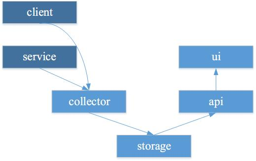
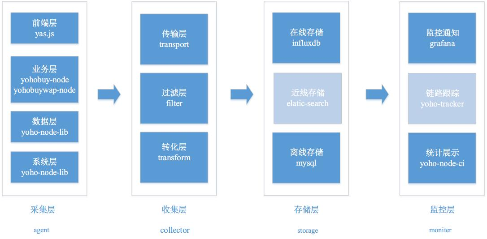
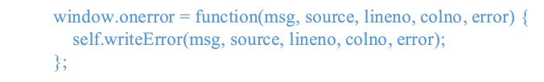
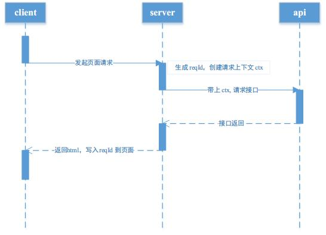
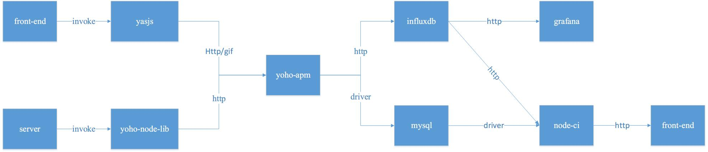

# 有货前端 Web-APM 实践

## 0 背景

有货电商技术架构上采用的是前后端分离，前端是主要以业务展示和接口聚合为主，后端以提供较小的业务数据接口为主。在实际应用场景下，前后端应用对系统性能的关注点是不一样。因此，前端团队需要跟据自身的需求，来搭建自己的 APM 系统。

## 1 前端的需求

对前端团队来说，用户体验至关重要，而页面的打开速度就是用户能感知因素中最重要的一环。前端团队对 APM 的需求就是要尽可能地收集与页面打开速度有关的因素。经过对业务和技术的讨论，我们认为以下方面影响了页面的加载速度：

### (1) 前端加载时间

在前端页面加载是用户感知的第一层。我们使用以下指标：

* 首屏加载时间：first-Screen
* 文档加载时间：DOMContentLoaded
* 页面加载时间：load
* 页面脚本错误：error

除了加载时间，我们还会把前端 js 运行过程中出现的错误上报。这样，我们就能够及时发现问题，快速修复上线，使公司损失最小化。

### (2) 业务处理时间

* http 响应时间：req-res-time
* http 请求状态：http-status

这块我们主要关注页面请求到页面响应完成的时间：req-res-time，这个时间能够代表我们系统的响应速度，所以这个指标能衡量当时系统的性能。

此外，还会针对 http 状态码这个值也进行记录，这样就可以知道哪些路由有问题，这样就可以通过状态码的情况得到系统的健康程度。

### (3) 接口调用时间

* api 调用时间：api-time
* api 调用状态：api-status

这块我们会对每个接口都监控其调用时间：api-time。同时我们还会针对每一次请求生成一个唯一 ID，对这个请求所调用的 api 进行标识，这样我们就能分析出，页面调用的接口数，每个接口调用的时间，接口的调用顺序等，这些数据对后端的压测和服务治理会非常有用。

同时，对 api 的响应状态码进行监控，方便及时了解后端接口的基本情况。

### (4) 系统运行状态

* cpu 使用率: process-cpu
* memory 使用率: process-mem

这块包括系统 cpu 和 memory 的使用情况做了收集，方便我们知道机器的情况。

针对这四个方面，我们设定了这 10 项指标，通过这些指标，我们这能全方位对我们网站业务的速度和稳定性进行了解，方便以后优化。

## 2 整体架构

Web-APM 在整体架构设计上，分成了六个部分，如下图所示，包括 client，service , collector, storage, api ,ui。箭头代表数据的流向。其中，client 和 service 是收集指标并发送指标，而 collector 作用是汇集指标，过滤数据，存入 storage。 stoarge 的存在，我们是希望能保存一段时间数据情况，方便事后进行查找和分析。 而 api 则是对 storage 的数据对外提供一个接口，方便监控和分析；ui 是提供一个界面，方便使用者进行查看。

## 3 实现

从实现角度来看，我们还是比较功利的，即采用我们自己熟悉的技术，并没有上来就使用 ELK Stack，这其中是有原因的：

1. 数据的体量上，百万级的已经够用了，用不上大数据这一套存储
2. 前端组的技术能力上，与 ELK Stack 技术栈不匹配，不能吃透这套技术
3. 当前也没有合适的人去做这块技术工作

于是我们跟据自己的需求和整体架构，在实现系统角度上，划分成了多个层，每个层有各自的选择，如下图所示：

注意：图中灰色的部分为未来规划。

从图中可以看出，Web-APM 系统实现上分成了 4 个层，分别是采集层，收集层，存储层和监控层，每一层我们都选择了合适的技术来实现。

### (1) 采集层

采集层对应着我们的需求，也分成了四块，包括前端层(yas.js), 业务层(yohobuy-node)，数据层(yohonode-lib)，系统层(yohonode-lib)。不同的层采集不同的数据，最终数据发送到收集层。

收集数据时，解决以下问题：

#### 首屏加载

我们参考了这篇[文档][1]，思路就是计算首屏基线高度之上的所有图片元素 onload 之后的时间。

#### 错误处理

利用 window.error 接口来实现，self.writeError 里面就是我们自己的上报逻辑。

#### 数据一致性

数据采集时，我们注意到数据不一致的问题。如路由。电商的页面很多，最多可能就商品详情页。从前端的角度来看商品详情页，每个商品详情页就是不同的 path，如 `https://www.yohobuy.com/product/51768088.html`。但从后端来看就不过是一个参数 :id 而已，如　`https://www.yohobuy.com/product/:id.html`。我们做监控的时候，不可能针对一个商品的链接进行监控，这样是没有什么用的，我们希望对商品详细页这一类的页面进行监控。　如果以前端的 path 来进行数据统计就只能统计到单个页面的问题，不能统计到商品详情页这一类的情况。当然可以在进行数据汇集的时候，进行正则匹配。这对我们来说不太现实，因为我们网站信息架构调整了多次，路由也已经调整多次，在另一个地方进行正则就意味着，要在另一个地方维护一张正则映射表。我们希望的是就一个地方维护路由。

这个问题我们进行了多次讨论，在技术的可行性下，选择了一个技术方案，在每个页面中，写入一个全局变量，把这个页面的后端路由的 md5 写入到页面中，这样只要这个页面路由不变，这个值就一直不变，发送监控数据就把这个路由值也带上，这样前后端的数据情况就能通过路 由对应起来，这样就能更方便的统计数据。

#### 请求跟踪

有货前端项目都是以 nodejs 为核心建立的技术栈。在 nodejs 中，一直缺较好的技术手段对异步进行跟踪和标识。目前来看 [async_hooks](https://nodejs.org/dist/latest-v8.x/docs/api/async_hooks.html) 技术应该是比较好的候选方案。但在对我们来说，该技术不是很合适。因为我们关注点会更高一点，只是针对业务流程进行跟踪，而不是对每一个异步进行细致的分析。在考虑到业务实际情况和技术实现，我们选择了基于 reqId 进行业务流程跟踪的方案。该方案时序图如下：

在页面请求过来时，我们针对这个请求生成 reqId，并且在调用后端 api 时，会带上 reqId 生成的上下文 ctx。最后返回页面时，把 reqId 写入用户的 cookie 中。同一个页面　ajax　发送请求时，就会去判断是否有这个 reqId，这样就能区分是页面上的　ajax 的请求，还是别的方式造成的请求，同时也能统计出页面上调用　ajax 请求的个数。

### (2) 收集层

收集层，主要定义一下从采集端过来的数据的形式(influxdb)，以什么协议传输(http)。

对打入的监控数据进行一个缓冲(buffer)，依据条件过滤(filter)出我们需要的数据，把数据形式转化(tranform)成我们想要的形式，洗好的数据定时写入存储层中。

### (3) 存储层

在存储层，我们分为在线存储和离线存储。在线存储是与监控有关需要实时交互的数据，使用 influxdb 时序数据库。在写入时，我们会把数据再精减，把最简单关键数据写入 influxdb 中，如 http-status, api-status, process, 方便下一层监控层使用。

influxdb 的使用中，我们也碰到了问题。例如：写入数据时 tag 过多，导致查询数据缓慢，我们就精减数据；为提高 influxdb 性能，会做一个队列，批量写入数据。

离线存储，我们选择是 mysql。在写入时，我们对数据进行过滤，主要保存错误，异常和慢路由。如前端和后端发生的错误(包括堆栈)，还有哪些路由的请求时间长于 2000ms，这样方便我们进行离线地分析查看和统计。

还有，由于我们项目的特点，对离线储存不是要求一直保存，我们会定时对 mysql 进行整理和清除，当前我们就只保留最近 7 天的数据，这样我们离线储存的压力就比较小。

### (4) 监控层

监控层，也是分成两部分，一个部分为 grafana ，利用 grafana 和 influxdb` 配合的提醒功能，能对我们的线上环境通过短信和邮件实时进行提醒。

另一部分是我们的 ci 系统，包括一个监控面板，用于查看详细的错误情况和路由情况。特别对于前端，我们发布的代码都是经过 webpack 打包的代码，直接去找错误行列肯定是找不到的，因此我们生打包生产代码时，会生成 source-map 文件，ci 查看前端脚本错误，会去解析 source-map, 拿到出错代码的前后 20 行，这样能方便地定位前端的错误。ci 每天都会去 mysql 查看路由的情况和异常的情况，生成统计报表，邮件给前端团队。

## 5 接入方式

当前 agent 代码，前端代码，为了满足功能需要，引入方式是将压缩后的 agent 代码直接插入到布局模板的 head 中。配置项目是在压缩时就写入定值，这样能减经原来项目接入的复杂度。

对于服务器端代码的接入，我们当前没有采用独立进程的方式进行部暑，这是因为使用者和维护者都是同一个团队，还有监控这块对性能影响并不是很大。所以我们接入方式大部分直接引入一个独立的包就可以完成工作，少部分的代码直接传入 express 对象代理接口和监听事件，就能拿到数据，做到业务无感知。

收集层我们是独立部署的一台服务器，这样会更方便。而且我们设计成收集层挂了，也不会影响我们采集层的工作。

下图是系统的调用情况：

## 6 总结

当前，有货 Web-APM 基础的功能已经完成，已经在有货 pc 站和 h5 站项目进行布署，进行监控数据的上报。通过这个系统我们对前端系统的性能有了一个深入的认识，并且对我们以后优化工作指明了方向。我们会在以后的工作中升级该系统，引入 elasticsearch，开发基于 traceId 的 Web 事务查看，基于 Web 事务的统计等。

以上就是我们有货前端团队 Web-APM 的实践分享，欢迎大家批评指正。

[1]: https://www.zhihu.com/question/23212408/answer/56647975